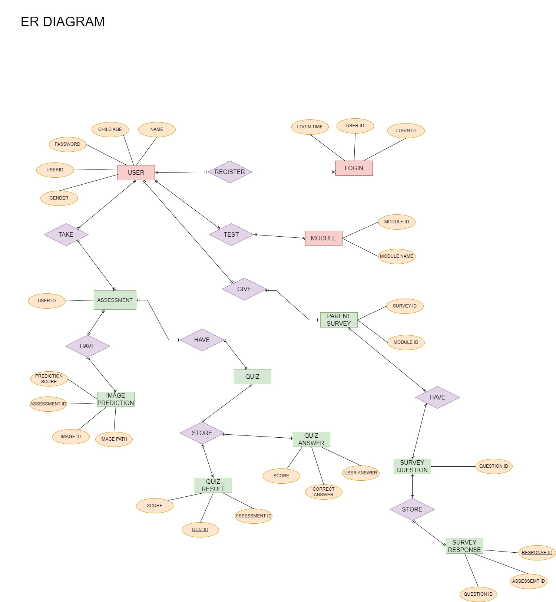

# Dyslexia-Prediction-Model:
<b>Our mission</b> - To predict the chances of a person to be suffering from dyslexia.

# Machine Learning Algorithm Proposed:                        
- <b><u>Random Forest Model</u></b>: It trains a random Forest model using the training data and evaluates its performance on the testing data. It prints the accuracy scores and visualizes the confusion matrices using seaborn's heatmap.

- <b><u>Decision Tree Model</u></b>: It trains a decision tree classifier using the training data and evaluates its performance on the testing data. Similarly, it prints the accuracy scores and visualizes the confusion matrices.

# Technologies Used: 
  <b>Frontend Development</b> -
  - React.js
  - CSS used - Tailwind, Bootstrap
  - Javascript

  <b>Backend Development</b> - 
  - Express.js & Node.js
  
  <b>Database</b> - 
  - MongoDB
  - Cloudinary

  <b>Test & Traning Data</b>
  - Kaggle

  <b>Third Party Apis<b>
  - ApiLayer

# Input:
<b>Image Module</b> - User upload image file of the written text of the dyslexic person.
<b>Quiz Module</b> - User attempt a quiz based on the cognitive abilities such as reding, listening & writting. 

# Ouput:
<b> Predict the risk of dyslexia </b>

# Digrams: 
- <b>ER Digram -</b> 

https://dyslexilens-web.vercel.app/

